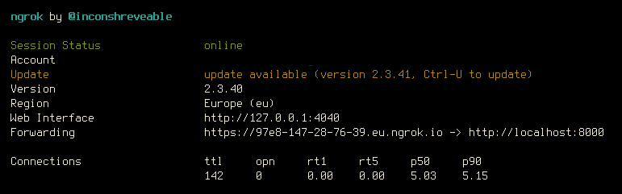
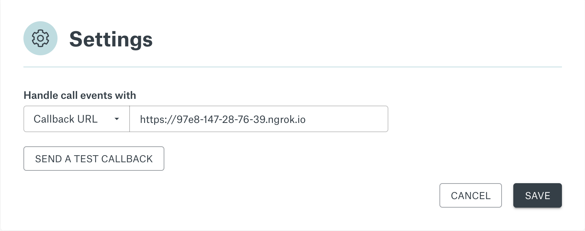

# Sinch Voice API Callback application Node.js

## Callback Request Signing

The Sinch Platform can initiate callback requests to a URL you define (Callback URL) on events like call initiation, call answer, and call disconnect. All callback requests are signed using your Application key and secret pair found on the [Sinch Dashboard](https://dashboard.sinch.com/voice/apps). The signature is included in the authorization header of the HTTP request.

This code sample will:

1. Validate the signature to ensure the call event originates from Sinch.
2. Respond with a [Sinch Voice Application Markup Language (SVAML)](https://developers.sinch.com/docs/voice/api-reference/svaml/) example on the [ICE](https://developers.sinch.com/docs/voice/api-reference/voice/tag/Callback-API/) event (Conference connect).
3. Respond with 200OK for the DICE event.

### Requirements

- [node v16.*](https://nodejs.org/en/) or later
- [ngrok](https://ngrok.com)

### Install

1. Use environment variables for your application key and secret. Create an `.env` file with your credentials for your application from the [Sinch dashboard](https://dashboard.sinch.com/voice/apps) in the format shown:

    ```bash
    APP_KEY="YOUR_app_key"
    APP_SECRET="YOUR_app_secret"
    ```

2. Run `npm install` to install the required dependencies.
3. Start the server using the following command: `node index.js`
4. Start ngrok using `ngrok http 8000`

    

5. Take the ngrok URL example `https://97e8-147-28-76-39.ngrok.io`
6. Copy it to the Voice & Video application you are using [Sinch dashboard](https://dashboard.sinch.com/voice/apps)

    

7. Click **Save** and test your connection!
8. Make that call! You can test direct from the [Sinch dashboard](https://dashboard.sinch.com/voice/apps) or use the samples [here](https://dashboard.sinch.com/voice/apps)

If you want to inspect the incoming call events please set `DEBUG=ON` in the `.env` file.
